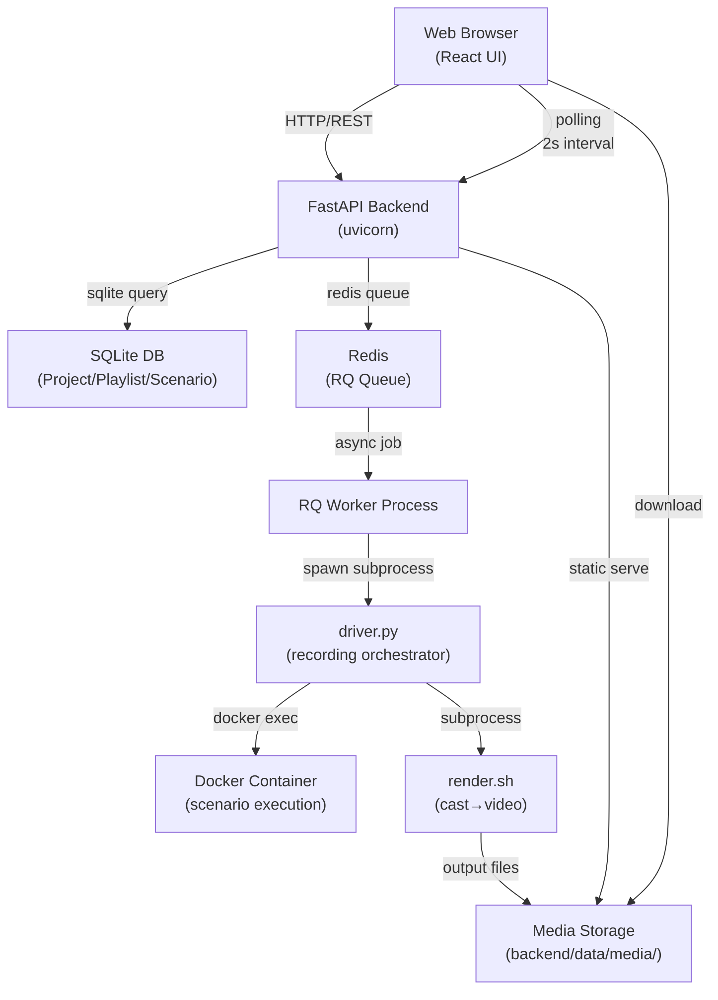
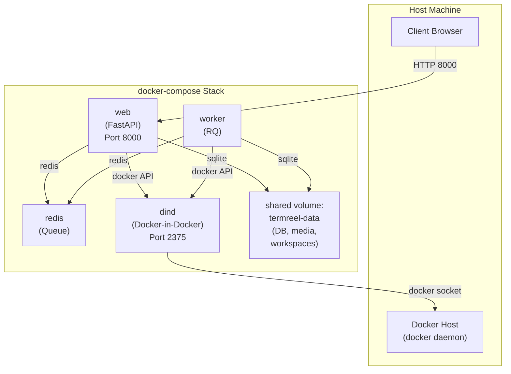

# System Architecture

This document describes the high-level architecture of Termreel, including component interactions, data flow, and the critical bridge between the web app and the CLI pipeline.

## Architectural Overview

Termreel consists of three main layers:

1. **CLI Recording Pipeline** (root `driver.py` + `render.sh`): Standalone tool for recording and rendering terminal sessions
2. **Backend API** (FastAPI + SQLModel + RQ): Web application backend that orchestrates rendering and manages project/scenario state
3. **Frontend UI** (React + TanStack Query): Interactive web UI for authoring scenarios and monitoring renders

The key architectural principle is that the backend never reimplements the CLI pipeline; it always shells out to the unmodified root `driver.py` and `render.sh`. This is a repo-level invariant, not a preference: any fix to recording/rendering behavior belongs in the CLI layer, and a PR that duplicates pieces of it in the backend is out of policy regardless of the feature it serves.

## High-Level Data Flow



## Component Architecture

### 1. Frontend (React SPA)

**Location**: `frontend/src/`

**Responsibilities**:
- Renders UI for project/playlist/scenario browsing and authoring
- Collects user input (step forms, config, environment variables)
- Converts form input to Scenario YAML format (client-side via `js-yaml`)
- Polls backend for job status every 2 seconds while rendering
- Displays render progress and logs

**Key Interactions**:
- Sends POST to `/api/scenarios/{id}/render` to enqueue a job
- Polls GET `/api/jobs/{id}` to check status (queued → running → done/failed)
- Fetches GET `/api/jobs/{id}/log` to display logs in real-time
- Downloads rendered artifacts from `/media/{job_id}/{filename}`

**State Management**:
- Server state via TanStack Query (job status, scenario data)
- Local UI state via React hooks (dialog open/close, form inputs)

### 2. Backend API (FastAPI)

**Location**: `backend/app/`

**Responsibilities**:
- RESTful CRUD for projects, playlists, scenarios
- Validates scenario data (step types, required fields, flavours)
- Enqueues render jobs to the RQ queue
- Manages job status and captures streaming logs
- Serves rendered media files as static content

**Key Subsystems**:

#### a. Database Layer (`models.py`, `db.py`)
- SQLModel ORM: `Project` → `Playlist` → `Scenario` → `RenderJob` (cascade delete)
- JSON columns store scenario configuration and steps (exactly shaped to match CLI YAML format)
- Single SQLite connection per app instance

#### b. Render Pipeline Bridge (`render_pipeline.py`)
**This is the critical bridge between the web app and CLI pipeline.**

```python
def run_render(job_id, scenario_title, docker_cfg, typing_cfg, steps, on_log, theme):
    # Step 1: Materialize workspace (isolated, per-job copy of mount_host_path)
    workspace_dir = _materialize_workspace(job_id, mount_host_path)
    
    # Step 2: Write scenario YAML to disk
    scenario_yaml_path = _materialize_scenario_yaml(
        job_id, scenario_title, docker_cfg, typing_cfg, steps
    )
    
    # Step 3: Shell out to unmodified CLI pipeline
    subprocess("python3 driver.py {yaml_path} --out {cast_path}")
    
    # Step 4: Render cast to video
    subprocess("./render.sh {cast_path} {out_base} {theme}")
    
    # Step 5: Return artifact paths
    return {media_path: "/media/{job_id}/..."}
```

**Key Features**:
- Materializes inline step content (`write_file`/`write_vim`/`presenterm`) to disk files
- Creates job-scoped workspace directory (no concurrent-render interference)
- Streams subprocess output to DB via `on_log` callback, mirroring the in-container pty session (true streaming, not buffered)
- Strips ANSI/terminal control sequences before storing
- Raises `RenderError` on non-zero exit code or missing output files

#### c. Job Queue (RQ)

```python
@job(queue="renders", job_timeout=1800)
def render_scenario_job(job_id: int):
    job = db.get(RenderJob, job_id)
    scenario = job.scenario
    
    try:
        job.status = "running"
        db.commit()
        
        artifacts = render_pipeline.run_render(
            job_id,
            scenario.title,
            scenario.docker,
            scenario.typing,
            scenario.steps,
            on_log=lambda chunk: update_job_log(job_id, chunk),
            theme="dracula"  # configurable
        )
        
        job.status = "done"
        job.artifacts = artifacts
        db.commit()
    except Exception as e:
        job.status = "failed"
        job.error = str(e)
        db.commit()
        raise
```

**Queue Behavior**:
- Single queue named `"renders"`
- 30-minute timeout per job (`job_timeout=1800`)
- Status transitions: queued → running → done/failed
- Logs streamed in real-time (not buffered until completion)

#### d. Scenario Validation (`schemas.py`, `routers/scenarios.py`)

```python
class ScenarioStep(BaseModel):
    type: Literal["command", "comment", "write_file", "write_vim", "presenterm"]
    
    # Common fields
    name: str | None = None
    
    # Type-specific fields (required per type)
    # command: shell_command (required)
    # comment: text (required)
    # write_file: path (required), content (required)
    # write_vim: path (required), content (required), simulate_typos (optional), force_blank (optional)
    # presenterm: path (required), content (required), slide_pause (optional, default 2.0)
    
    @model_validator(mode='after')
    def validate_required_fields(self):
        # Enforce per-type required fields
        if self.type == "command" and not self.shell_command:
            raise ValueError("command step requires shell_command")
        # ... etc
        return self
```

**Validation Rules**:
- Each step must have required fields for its type
- `write_vim` content length guardrail: reject if content would take > 60s to type at configured `base_cps`
- `docker.flavour` must exist in the manifest (`flavours/flavours.yaml`)
- Steps list must not be empty (renders require at least one step)

#### e. API Routers

All endpoints prefixed `/api/`:

- **`/projects`**: CRUD projects
- **`/projects/{projectId}/playlists`**: CRUD playlists (nested)
- **`/playlists/{playlistId}/scenarios`**: CRUD scenarios (nested)
  - `GET /{scenarioId}/yaml`: Export scenario as YAML (must match CLI pipeline format exactly)
- **`/jobs`**: Job lifecycle
  - `POST /render`: Enqueue render job
  - `GET /{jobId}`: Poll job status (returns full job object with status, error, etc.)
  - `GET /{jobId}/log`: Stream plaintext log (ANSI sequences already stripped)
- **`/flavours`**: Flavour catalog (read-only, backed by `flavours/flavours.yaml`)

### 3. CLI Recording Pipeline (driver.py + render.sh)

**Location**: Root `driver.py`, root `render.sh`

**Responsibilities**:
- Parse scenario YAML
- Start Docker container with specified flavour
- Execute steps in sequence via pexpect PTY (simulating typing)
- Record terminal session to asciinema `.cast` file
- Convert `.cast` to MP4/GIF

**Step Type Dispatcher** (`driver.py`'s `do_step()` function):

```python
def do_step(step, container_name, workspace_dir, ...):
    step_type = step.get("type")
    
    if step_type == "command":
        run_command(shell_command, container_name)
    elif step_type == "comment":
        run_comment(text, container_name)  # Types as # comment
    elif step_type == "write_file":
        run_write_file(path, content, container_name)  # Heredoc paste
    elif step_type == "write_vim":
        run_write_vim(path, content, container_name, simulate_typos)  # Type into vim
    elif step_type == "presenterm":
        run_presenterm(path, content, slide_pause, container_name)  # Markdown slides
    else:
        raise ValueError(f"Unknown step type: {step_type}")
```

**Key Implementation Details**:

- **Locale handling**: All container execs use `LC_ALL=C.UTF-8` to prevent readline cursor corruption with multi-byte text
- **Diff-driven editing** (`write_vim`): If target file exists, read current content via `docker exec`, compute character-level diff, drive vim motions to transform
- **Typo simulation**: Optional per-step; types random nearby keys (QWERTY adjacency) with random insertion/deletion
- **Presenterm slides**: Auto-counts slides via `<!-- end_slide -->` markers, sends synthetic terminal attributes to unblock presenterm's terminal probe, paces slide advances
- **Flavour resolution**: `resolve_flavour_image(flavour_id)` builds Dockerfile from `flavours/{id}/Dockerfile`, tags as `termreel-flavour-{id}`, caches by tag

**Rendering** (`render.sh`):

```bash
./render.sh <cast_file> <out_basename> [theme]
# Produces: <out_basename>.gif (via agg) and <out_basename>.mp4 (via ffmpeg)
```

- Configurable theme (asciinema theme name, default "dracula")
- Configurable playback speed and font size (edit `render.sh` for these)

## Data Flow: End-to-End Render

1. **Author creates scenario in UI**
   - Form-based step authoring
   - Client-side YAML preview (via `js-yaml`)
   - POST `/api/scenarios` with scenario definition

2. **Backend stores scenario**
   - Validates step types and required fields
   - Validates `docker.flavour` against manifest
   - Validates `write_vim` typing-time guardrail
   - Stores to SQLite with JSON columns (`docker`, `typing`, `steps` all stored as JSON)

3. **Frontend enqueues render**
   - POST `/api/jobs/{scenarioId}/render`
   - Backend creates `RenderJob` row with status `queued`
   - Enqueues `render_scenario_job(job_id)` to RQ queue
   - Returns job ID to frontend

4. **Frontend polls job status**
   - GET `/api/jobs/{jobId}` every 2 seconds
   - While status is `queued`, displays "Waiting in queue..."
   - Once status becomes `running`, starts fetching `/api/jobs/{jobId}/log`

5. **RQ Worker dequeues and executes job**
   - `render_scenario_job(job_id)` starts
   - Sets `RenderJob.status = "running"`
   - Calls `render_pipeline.run_render()`

6. **Backend materializes scenario**
   - Reads scenario from DB
   - Creates isolated workspace: `backend/data/workspaces/{job_id}/` (copy of mount_host_path)
   - Writes scenario YAML to disk
   - Materializes inline step content (write_file/write_vim/presenterm) to separate files on disk
   - Streams all subprocess output to `RenderJob.log` via callback

7. **CLI pipeline executes**
   - `python3 driver.py scenario.yaml --out session.cast`
   - Starts Docker container with resolved flavour image
   - Executes each step: type commands, type comments, type files, edit files, present slides
   - Records terminal session to `session.cast` via asciinema
   - Tears down container

8. **Rendering stage**
   - `./render.sh session.cast job_{job_id} dracula`
   - Produces `job_{job_id}.gif` and `job_{job_id}.mp4`
   - Files written to `backend/data/media/{job_id}/`

9. **Backend captures results**
   - `render_pipeline.run_render()` returns with artifact paths
   - Backend stores paths in `RenderJob.artifacts`
   - Sets status to `done`
   - Commits to DB

10. **Frontend downloads**
    - Polls detect status `done`
    - Render card shows download links to `/media/{job_id}/{filename}`
    - Backend's StaticFiles middleware serves files from `backend/data/media/`

## Database Schema

```
Project
├── id (PK)
├── title
├── description
├── created_at
└── Playlist (FK project_id, cascade)
    ├── id (PK)
    ├── project_id (FK)
    ├── title
    ├── created_at
    └── Scenario (FK playlist_id, cascade)
        ├── id (PK)
        ├── playlist_id (FK)
        ├── title
        ├── docker: JSON (flavour, mount_host_path, env vars)
        ├── typing: JSON (base_cps, jitter_pct)
        ├── steps: JSON (array of step objects)
        ├── created_at
        └── RenderJob (FK scenario_id, cascade)
            ├── id (PK)
            ├── scenario_id (FK)
            ├── status (queued|running|done|failed)
            ├── log (text, streamed)
            ├── artifacts: JSON (paths to mp4, gif, etc.)
            ├── error (string, on failure)
            └── created_at
```

## Workspace Isolation

Each render job gets its own isolated filesystem:

```
backend/data/workspaces/{job_id}/
├── (entire copy of mount_host_path, e.g., demo-repo/)
├── scenario.yaml (materialized)
├── file-1.txt (materialized from write_file step)
├── slides.md (materialized from presenterm step)
└── ... (any other files referenced by steps)
```

When the container is started, this workspace is mounted at the path specified in `Scenario.docker.mount_host_path`. Concurrent renders don't interfere because each has its own workspace.

**Cleanup**: Workspaces are **not** automatically deleted when jobs complete or are deleted; they accumulate under `backend/data/workspaces/`. This preserves job context for debugging but is a known limitation — media and workspace cleanup is a candidate for a future feature if disk usage becomes a problem.

## Deployment Topology (docker-compose)



**Services**:

- **web**: FastAPI app + frontend static assets (if prod build exists)
  - Ports: 8000 (exposed)
  - Volumes: `termreel-data:/app/backend/data`
  - Env: `REDIS_URL=redis://redis:6379/0`, `DOCKER_HOST=tcp://dind:2375`
  - Healthcheck: `GET /api/health`

- **worker**: RQ worker process (same image as web)
  - Ports: none (internal only)
  - Volumes: `termreel-data:/app/backend/data` (shared with web)
  - Env: same as web (REDIS_URL, DOCKER_HOST)

- **redis**: Redis queue backend
  - Ports: none (internal only, accessed via `redis://redis:6379`)
  - No persistent storage (ephemeral)

- **dind**: Docker-in-Docker for isolation
  - Ports: 2375 (internal, no TLS in dev)
  - Volumes: `dind-storage` (persistent Docker images/containers)
  - Privileged mode required

**Shared Volumes**:
- `termreel-data`: SQLite DB, rendered media, workspaces (survives container restart)
- `dind-storage`: Docker image/container storage (survives container restart)

## Scalability Considerations

**Current design assumes single operator**:

- No authentication
- One RQ worker (no concurrency)
- Polling-only status (no websockets)
- Single SQLite connection
- No horizontal scaling of backend

**Future scaling points** (if needed):

1. **Multiple workers**: Add more `worker` services in docker-compose, all pointing to same Redis queue
2. **Push notifications**: Replace polling with websockets or SSE
3. **Authentication**: Add user model, sessions, RBAC
4. **Database**: Migrate from SQLite to PostgreSQL (SQLModel works with both)
5. **Async backend**: Migrate from sync FastAPI to async (if I/O-bound becomes an issue, unlikely for rendering workloads)

## Invariants & Constraints

1. **Backend never reimplements CLI pipeline**: Always shells out to root `driver.py`/`render.sh`
2. **Cascade delete invariant**: Deleting any parent cascades all children; no orphaned records in DB
3. **Job-scoped isolation**: Each render gets its own workspace and media directory
4. **Exact YAML round-tripping**: Backend's `GET /scenarios/{id}/yaml` is identical to CLI pipeline's input format
5. **Separate uv projects**: Root and backend have independent lock files; never merged into a workspace
6. **Polling-only status**: No websockets; frontend polls on 2s interval

## Key Invariants & Constraints (Critical to Preserve)

1. **Backend never reimplements CLI pipeline**: Always shells out to root `driver.py`/`render.sh`
2. **Cascade delete invariant**: Deleting any parent (Project/Playlist/Scenario) cascades all children; no orphaned records in DB
3. **Job-scoped isolation**: Each render gets its own workspace and media directory
4. **Exact YAML round-tripping**: Backend's `GET /scenarios/{id}/yaml` is identical to CLI pipeline's input format
5. **Separate uv projects**: Root and backend have independent lock files; never merged into a workspace
6. **Polling-only status**: No websockets; frontend polls on 2s interval
