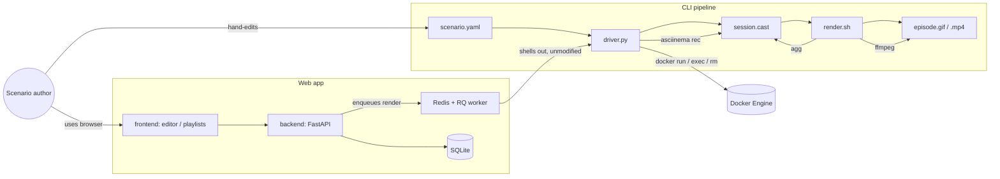

# Actors & context

## Actors

| Actor | Description |
|---|---|
| **Scenario author** | Uses either the CLI (hand-edits scenario YAML) or the web editor (`ScenarioEditorPage`) to define an episode's Docker environment, typing style, and steps. |
| **Viewer / consumer** | Downloads or plays the rendered `.gif`/`.mp4` for use in a video editor. Not modeled as a distinct system user — same person as the author in practice today. |

There is currently exactly one class of human actor with full read/write
access to everything; see [Out of scope](./introduction.md#out-of-scope).

## External systems

| System | Role |
|---|---|
| **Docker Engine** | Runs the disposable container each recording executes inside (`driver.py` `docker run` / `docker exec` / `docker rm -f`). |
| **asciinema** | Records the pty session to a `.cast` file (`asciinema rec`) and (indirectly, via the CLI) plays it back for humans. |
| **agg** | Renders a `.cast` file to a themed `.gif` (`render.sh`). |
| **ffmpeg** | Converts the `.gif` to a web-ready `.mp4` (`render.sh`). |
| **Redis + RQ** | Backs the web app's async render queue (`backend/app/queue.py`, `worker.py`); a separate worker process pulls jobs and calls the same pipeline. |
| **SQLite (via SQLModel)** | Persists `Project` / `Playlist` / `Scenario` / `RenderJob` rows for the web app. |
| **Filesystem (`backend/data/`)** | Holds the SQLite DB, rendered media (`data/media/<job_id>/…`), and per-job workspaces (`data/workspaces/<job_id>/…`); gitignored. |

## Context

